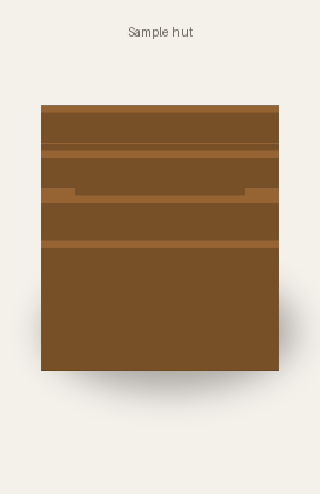
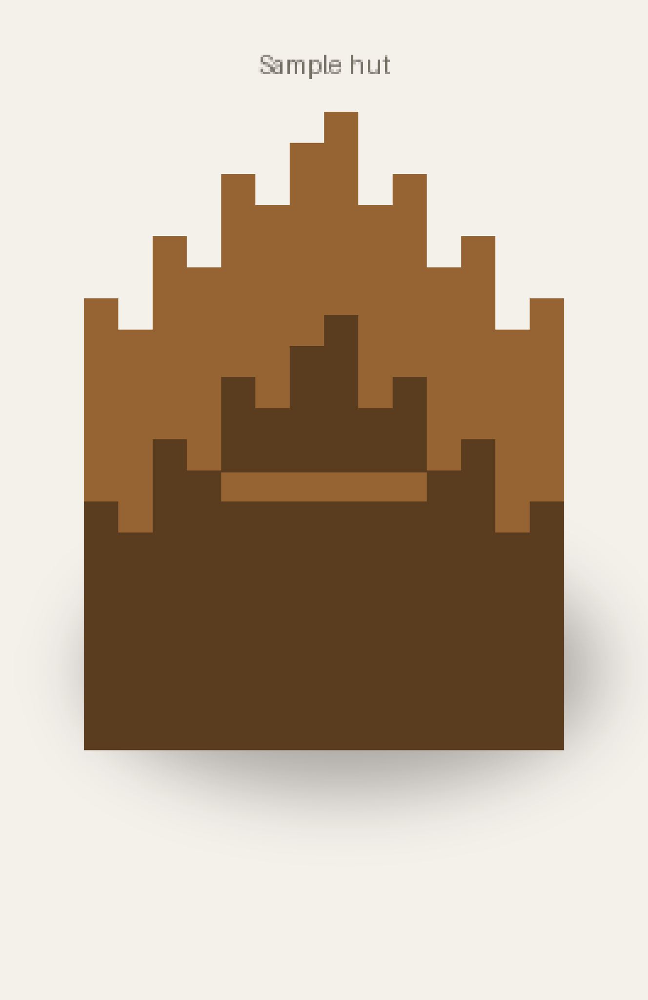
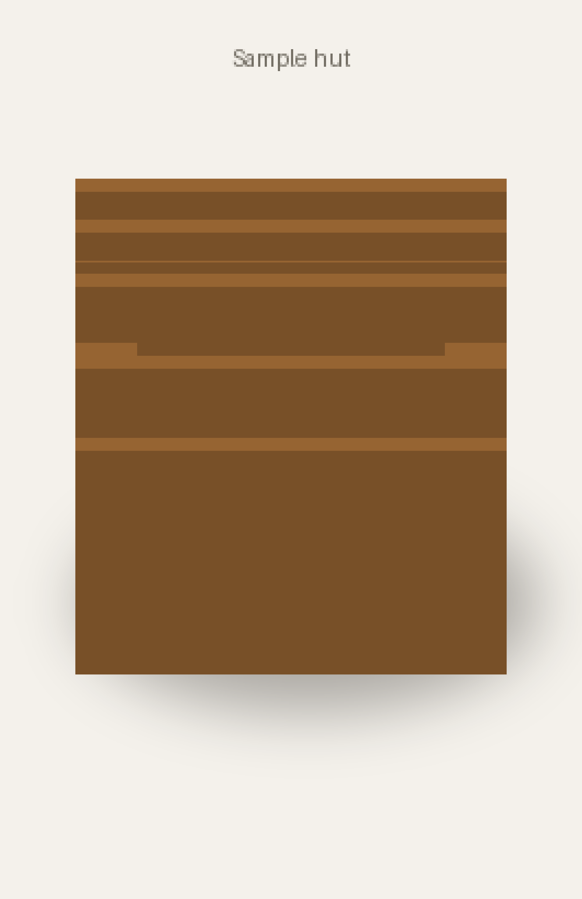
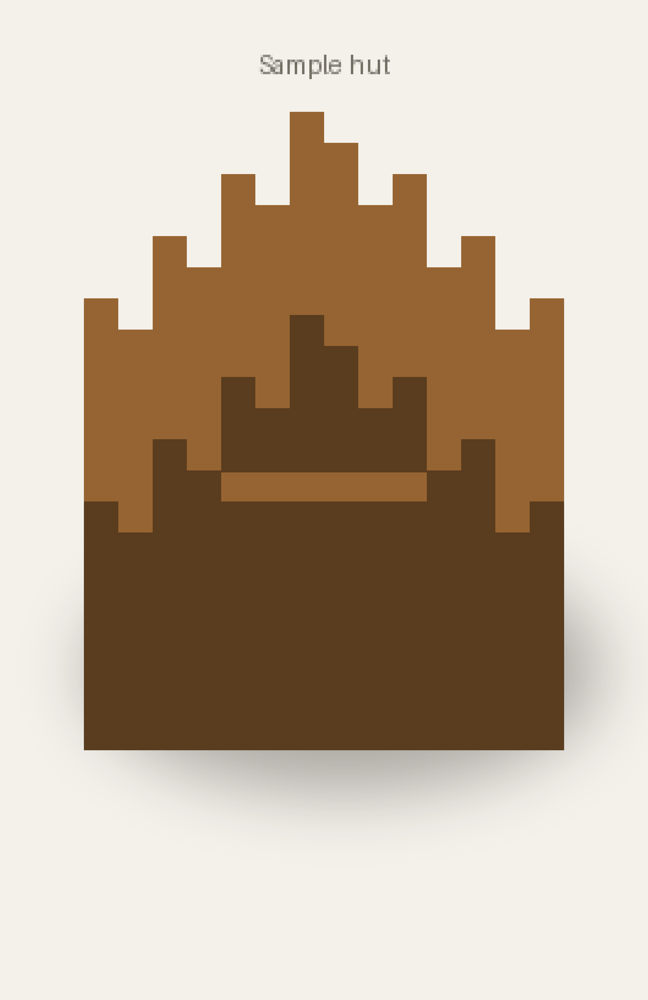
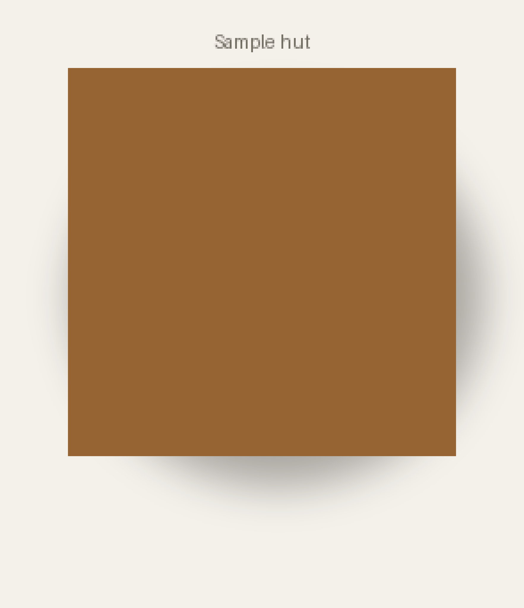
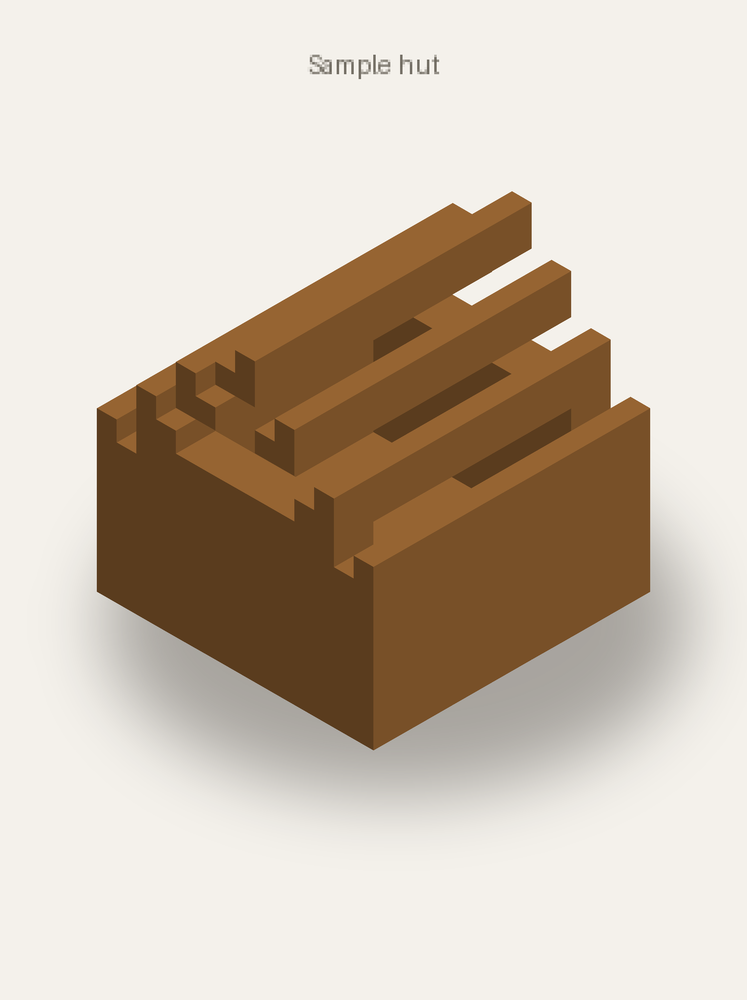

# Views gallery

What the six standard camera views look like, rendered from a tiny
7×7 plank hut with a gable roof (faithful tier, presentation look).

The gallery set is the four cardinal low-angle views plus `top` and
`iso`:

| View | One-line description |
|---|---|
| `az000_el025` | Front, from the north at 25° elevation — north wall and roof slope face-on. |
| `az090_el025` | East side, 25° elevation — the gable end of the hut (ridge runs along X). |
| `az180_el025` | Rear, from the south at 25° elevation — mirror of the north view. |
| `az270_el025` | West side, 25° elevation — the other gable end. |
| `top` | Straight down (elevation 90°) — roof footprint and ridge line in plan. |
| `iso` | Default three-quarter view (`az045_el035`) — fastest read of the whole build. |













---

Regenerate (hermetic — no network, reuses the fake vanilla asset tree
from `tests/test_preview_faithful.py`):

```bash
.venv/bin/python docs/views-gallery/generate.py
```
